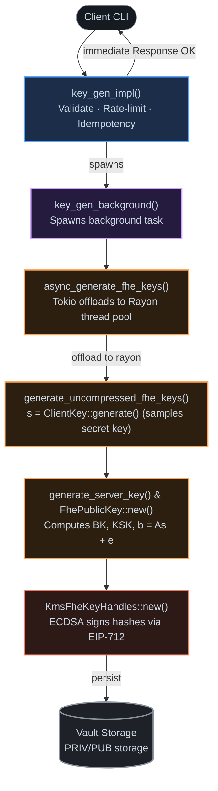
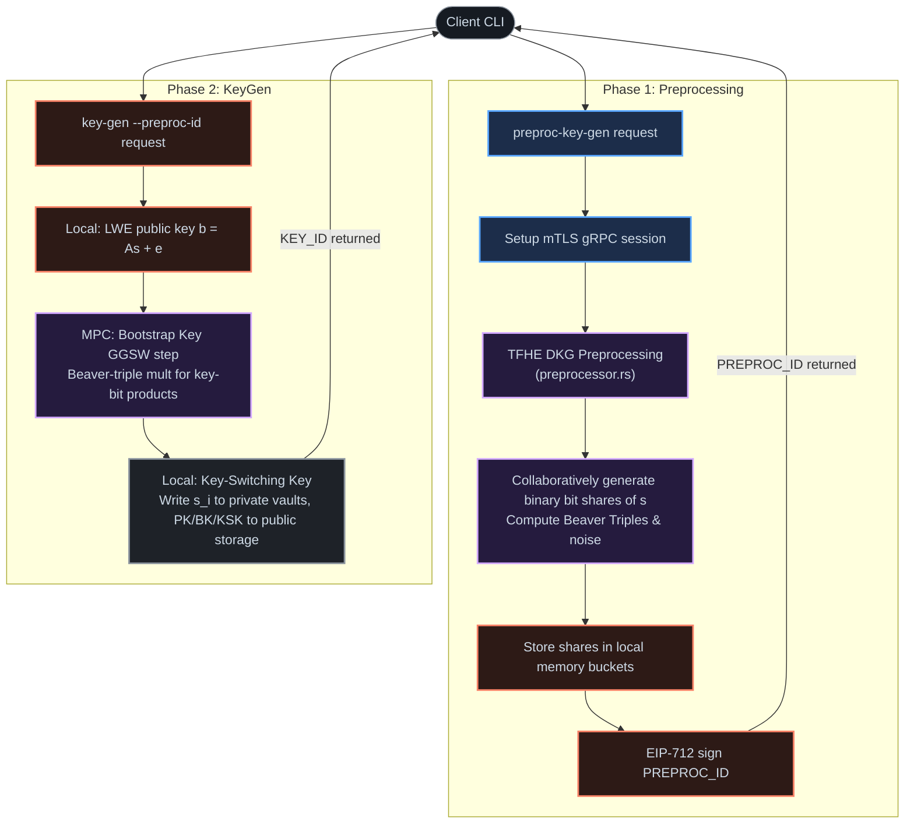

# KeyGen Math & Code Deep Dive

> This document connects the mathematical formula $b = As + e$ to the concrete implementation in both Centralized and Threshold KMS modes.
>
> **Back to:** [tutorial.md](./tutorial.md)

> [!warning] Erratum
> `raw/lwe-math-to-code-mapping.md` (archived, not edited) wrongly cites `kms-gen-keys.rs` for LWE keygen (it only makes the signing key) and a nonexistent `compute_cipher` function (real one: `compute_cipher_from_stored_key`). Its core $b=As+e$ math is otherwise fine.

---

## 1. Math to Code Mapping

Here is how the LWE equation $\mathbf{b} = \mathbf{A}\mathbf{s} + \mathbf{e} \pmod q$ translates to the `tfhe-rs` structs:

| Mathematical Variable | Description | Concrete Rust Struct |
| :--- | :--- | :--- |
| $\mathbf{s}$ | Secret key (binary vector, $s_i \in \{0,1\}$ — see [threshold deep dive](./threshold_dkg_deep_dive.md#1-what-tfhe-dkg-actually-produces)) | `tfhe::ClientKey` (stored in `KmsFheKeyHandles`) |
| $\mathbf{e}$ | Error/noise vector | Handled internally by `tfhe-rs` |
| $\mathbf{A}$ | Public random matrix | Handled internally / compressed via seed |
| $\mathbf{b}$ | Masked vector (LWE public key) | `tfhe::FhePublicKey` (stored in `FhePubKeySet`) |
| **Bootstrap Key (BK)** | GGSW encryption of each LWE-key bit under a *second*, GLWE secret key — a separate artifact, not folded into $b=As+e$ | `tfhe::ServerKey` (stored in `FhePubKeySet`) |
| **Key-Switching Key (KSK)** | Linear LWE encryption of one key's bits under another key | `tfhe::ServerKey` (stored in `FhePubKeySet`) |

---

## 2. Centralized KeyGen: Code Walkthrough

In centralized mode, the server handles all computation itself. Here is the call trace and flow:



### Call Trace:
```
[gRPC Client] ──(gRPC: KeyGenRequest)──>
    │
    ├── [Layer 1] key_gen_impl (core/service/src/engine/centralized/service/key_gen.rs)
    │     ├── Validates inputs & rate-limits
    │     └── Spawns tokio background task (returns Response<Empty> immediately)
    │
    ├── [Layer 2] key_gen_background (core/service/src/engine/centralized/service/key_gen.rs)
    │     └── Dispatches to async key generation path
    │
    ├── [Layer 3] async_generate_fhe_keys (core/service/src/engine/centralized/central_kms.rs)
    │     └── Spawns rayon task (rayon::spawn_fifo) to offload heavy CPU work from Tokio
    │
    ├── [Layer 4] generate_uncompressed_fhe_keys (core/service/src/engine/centralized/central_kms.rs)
    │     ├── ClientKey::generate()      <-- Samples secret key s
    │     ├── generate_server_key()     <-- Computes bootstrapping evaluation keys (BK/KSK)
    │     └── FhePublicKey::new()       <-- Calculates public key b = As + e
```

---

## 3. Threshold KeyGen: DKG Walkthrough

In threshold mode, the secret key $\mathbf{s}$ and noise $\mathbf{e}$ are never generated in one place. Instead, they are generated as distributed secret shares via Multi-Party Computation (MPC).



### Breakdown:

*(Real TFHE path — see [threshold_dkg_deep_dive.md](./threshold_dkg_deep_dive.md) for full detail and code citations.)*

#### A. Preprocessing Step (Distributed Key Generation Pre-computation)
*   **Trigger**: Client calls `preproc-key-gen`.
*   **Orchestrator**: `preprocessor.rs:188`
*   **Action**: Nodes form gRPC/mTLS sessions and collaboratively run the offline parts of the real TFHE DKG protocol:
    1.  Generate binary bit shares of the secret keys (LWE + GLWE) via `next_bit_vec`.
    2.  Generate noise shares.
    3.  Pre-compute multiplication helper shares (**Beaver Triples**) — needed later for the Bootstrap Key's GGSW step.

#### B. KeyGen Step (Collaborative Public-Artifact Generation)
*   **Trigger**: Client calls `key-gen --preproc-id <ID>`.
*   **Orchestrator**: [key_generator.rs](../core/service/src/engine/threshold/service/key_generator.rs) → [keygen.rs](../core/threshold-execution/src/endpoints/keygen.rs)
*   **Action**: Nodes consume their pre-computed secret-key bit shares to build three distinct public artifacts, in this order:
    1.  **LWE public key** — computed locally per node: $\mathbf{b} = \mathbf{A}\mathbf{s} + \mathbf{e}$, no MPC needed (mask $\mathbf{A}$ is public).
    2.  **Key-switching key** — also computed locally (linear LWE encryption of one key's bits under another).
    3.  **Bootstrap key** — the one step that *does* need MPC: GGSW-encrypts each LWE-key bit under the GLWE key, which requires multiplying two secret-shared values via Beaver triples.
    4.  Each node writes its **secret key shares** to its own private vault. No individual node ever learns the full key.

---

## 4. Key Files to Explore

For a deeper exploration, look at these specific files:

1.  **Centralized KeyGen Entrypoint**: [key_gen.rs](file:///Users/tsaiyunchen/Desktop/CSLAB/04_Work/kms/core/service/src/engine/centralized/service/key_gen.rs)
2.  **Centralized Crypto Wrapper**: [central_kms.rs](file:///Users/tsaiyunchen/Desktop/CSLAB/04_Work/kms/core/service/src/engine/centralized/central_kms.rs)
3.  **Threshold Preprocessing Entrypoint**: [preprocessor.rs](file:///Users/tsaiyunchen/Desktop/CSLAB/04_Work/kms/core/service/src/engine/threshold/service/preprocessor.rs)
4.  **Threshold KeyGen Entrypoint**: [key_generator.rs](file:///Users/tsaiyunchen/Desktop/CSLAB/04_Work/kms/core/service/src/engine/threshold/service/key_generator.rs)
5.  **DKG Math & Polynomial MPC (real path)**: [keygen.rs](file:///Users/tsaiyunchen/Desktop/CSLAB/04_Work/kms/core/threshold-execution/src/endpoints/keygen.rs)
6.  **Bootstrap Key / GGSW MPC multiplication**: [ggsw_ciphertext.rs](file:///Users/tsaiyunchen/Desktop/CSLAB/04_Work/kms/core/threshold-execution/src/tfhe_internals/ggsw_ciphertext.rs), [lwe_bootstrap_key_generation.rs](file:///Users/tsaiyunchen/Desktop/CSLAB/04_Work/kms/core/threshold-execution/src/tfhe_internals/lwe_bootstrap_key_generation.rs)
