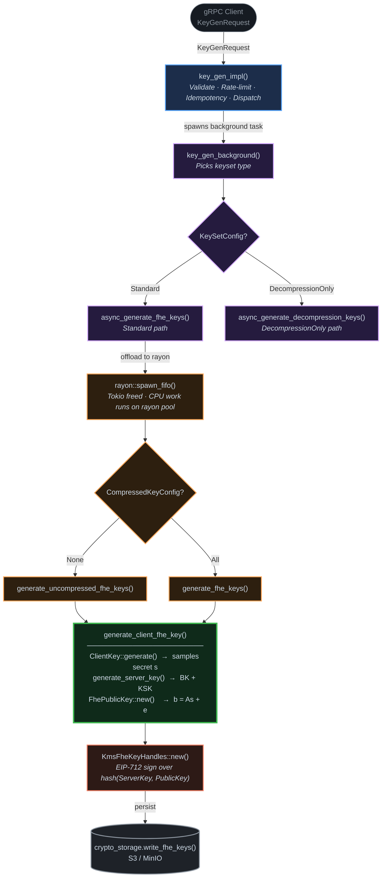

# Zama KMS — Key Generation Deep Dive

> **Focus**: Centralized mode key generation (the simpler, non-MPC path — a perfect foundation before studying the threshold version).

**Related notes:**
- [KMS Folder & Run Overview](./kms-folder-and-run-overview.md)
- [LWE Math → Code Mapping](./lwe-math-to-code-mapping.md)
- [Key Generation — Simple Story](./kms-keygen-simple.md) ← start here if new

---

## Call Flow Diagram



---

## The Math Recap (from your notes)

Key generation produces:
$$\mathbf{s} \leftarrow \text{sample secret}$$
$$\mathbf{A} \leftarrow \text{sample random matrix}$$
$$\mathbf{b} = \mathbf{A}\mathbf{s} + \mathbf{e} \pmod{q}$$

Where `s` is the LWE secret key, `A` is the public matrix, and `e` is small noise.
In `tfhe-rs`, this is wrapped inside `ClientKey` (holds `s`) and `FhePublicKey` / `ServerKey` (holds `A, b`).

---

---

## Layer 1 — gRPC Entry: `key_gen_impl`

**File**: [`key_gen.rs:41`](../kms/core/service/src/engine/centralized/service/key_gen.rs#L41)

This is the **gRPC handler**. It does NO crypto — only:
1. **Rate-limiting** (`service.rate_limiter.start_keygen(...)`)
2. **Validation**: parses `request_id`, `preproc_id`, `epoch_id`, `DKGParams` via `validate_key_gen_request()`
3. **Idempotency check**: verifies the key for this `req_id` doesn't already exist in storage
4. **Concurrency guard**: inserts a `CancellationToken` into `service.ongoing_key_gen` map
5. **Dispatch**: wraps the work in a future and hands it to `service.tracker.spawn(...)` — non-blocking, returns `Response<Empty>` immediately

```rust
// key_gen_impl returns immediately, actual crypto runs in background
service.tracker.spawn(
    async move {
        run_keygen_with_cancel(keygen_background, token, ...).await;
    }
    .instrument(tracing::Span::current()),
);
Ok(Response::new(Empty {}))  // ← client gets this right away
```

> **Insight**: key generation is *asynchronous* from the client's perspective. The client must then call `get_key_gen_result` to poll for completion.

---

## Layer 2 — Background Work: `key_gen_background`

**File**: [`key_gen.rs:428`](../kms/core/service/src/engine/centralized/service/key_gen.rs#L428)

Dispatches based on **keyset type**:

| `KeySetConfig` variant | Calls | Produces |
|---|---|---|
| `Standard` | `async_generate_fhe_keys()` | `ClientKey` + `ServerKey` + `FhePublicKey` |
| `DecompressionOnly` | `async_generate_decompression_keys()` | A key that converts between compressed keysets |

For standard keygen, it handles the two result variants:
```rust
match keygen_result {
    CentralizedKeyGenResult::Uncompressed(fhe_key_set, key_info) => {
        // pks = PublicKeySet::Uncompressed(...)
    }
    CentralizedKeyGenResult::Compressed(compressed_keyset, compact_public_key, key_info) => {
        // pks = PublicKeySet::Compressed { compact_public_key, compressed_keyset }
    }
}
// Then writes to storage:
crypto_storage.write_fhe_keys(req_id, epoch_id, key_info, pks, meta_store, op_tag).await
```

---

## Layer 3 — Async Wrapper: `async_generate_fhe_keys`

**File**: [`central_kms.rs:93`](../kms/core/service/src/engine/centralized/central_kms.rs#L93)

FHE key generation is **CPU-intensive**. Tokio's async runtime is for I/O; blocking it would starve other tasks. The solution:

```rust
let (send, recv) = tokio::sync::oneshot::channel();
rayon::spawn_fifo(move || {
    let out = match keyset_config.compressed_key_config {
        CompressedKeyConfig::None => generate_uncompressed_fhe_keys(...),
        CompressedKeyConfig::All  => generate_fhe_keys(...),
    };
    let _ = send.send(out);
});
recv.await  // ← async wait; Tokio thread is freed while rayon works
```

- **`rayon::spawn_fifo`** → runs on the rayon CPU thread pool (not Tokio's thread pool)
- **`oneshot::channel`** → bridges rayon → Tokio: rayon sends the result, Tokio awaits it

---

## Layer 4 — The Actual Crypto: `generate_uncompressed_fhe_keys` + `generate_client_fhe_key`

**Files**: [`central_kms.rs:296`](../kms/core/service/src/engine/centralized/central_kms.rs#L296) and [`central_kms.rs:354`](../kms/core/service/src/engine/centralized/central_kms.rs#L354)

### Step 1: Generate the Secret Key `s`

```rust
pub fn generate_client_fhe_key(params: DKGParams, tag: tfhe::Tag, seed: Option<Seed>) -> ClientKey {
    let config = params.to_tfhe_config();   // ← converts DKGParams to tfhe::Config
    let mut client_key = match seed {
        Some(seed) => ClientKey::generate_with_seed(config, seed),  // deterministic
        None       => ClientKey::generate(config),                   // random
    };
    *client_key.tag_mut() = tag;  // ← key tagged with request_id for domain separation
    client_key
}
```

`ClientKey` is **the secret key `s`** in the LWE formula. Under the hood, `tfhe-rs` samples `s` from a distribution (binary or ternary, per parameters) and the GLWE secret key (the polynomial secret for bootstrapping).

### Step 2: Generate Public Keys from `s`

```rust
// Back in generate_uncompressed_fhe_keys:
let server_key = client_key.generate_server_key();   // ← bootstrapping key (A, b)
let public_key = FhePublicKey::new(&client_key);     // ← LWE public key (A, b)
let pks = FhePubKeySet { public_key, server_key };
```

| Key | Math | Contains |
|---|---|---|
| `ClientKey` | secret `s` | LWE secret key, GLWE key, compression key |
| `FhePublicKey` | `(A, b=As+e)` | Used by client to encrypt |
| `ServerKey` | evaluation keys | bootstrapping key (BK), keyswitching key (KSK) |

> **Insight**: `ServerKey` encodes `s` in a homomorphically encrypted form — it lets the server evaluate gates on ciphertexts without knowing `s`.

---

## Layer 5 — Compressed Path: `generate_fhe_keys`

**File**: [`central_kms.rs:227`](../kms/core/service/src/engine/centralized/central_kms.rs#L227)

For the compressed path (production default), `tfhe-rs` uses a **seeded/XOF-based** approach:

```rust
let (client_key, compressed_keyset) = CompressedXofKeySet::generate(
    config,
    private_seed_bytes,   // ← randomness seed (from seeder or provided)
    security_bits,
    max_norm_hwt,         // ← Hamming weight bound for secret key
    tag,
)?;
```

- **`CompressedXofKeySet`**: generates the full keyset but stores public keys in compressed/seeded form — much smaller on disk
- **`max_norm_hwt`**: enforces the Hamming weight bound `pmax` from `DKGParams.secret_key_deviations` — this ensures the secret key's weight is in `[(1-pmax)·n, pmax·n]` for statistical security

After generation:
```rust
let (public_key, server_key) = compressed_keyset.decompress()?.into_raw_parts();
```

---

## Layer 6 — Signing and Wrapping: `KmsFheKeyHandles`

**File**: [`base.rs:100`](../kms/core/service/src/engine/base.rs#L100)

After key generation, the KMS needs to **prove** to the blockchain that these are the right keys. It does this by:

```rust
pub struct KmsFheKeyHandles {
    pub client_key: FhePrivateKey,            // secret s — stored encrypted/private
    pub decompression_key: Option<DecompressionKey>,
    pub public_key_info: KeyGenMetadata,      // signed digests of public keys
}
```

The `KeyGenMetadata` contains **EIP-712 signatures** over hashes of `ServerKey` and `FhePublicKey`:

```rust
// compute_info_standard_keygen_from_digests (base.rs:323):
let sol_type = KeygenVerification::new_uncompressed(
    prep_id, key_id,
    server_key_digest.clone(),
    public_key_digest.clone(),
    extra_data.clone(),
);
let external_signature = compute_eip712_signature(sk, &sol_type, domain)?;
```

This signature is what the **blockchain verifies** — it proves the KMS server actually generated these keys for this specific request.

---

## Key Data Types Summary

| Rust Type | Math Entity | Role |
|---|---|---|
| `DKGParams` | crypto parameters | `n, q, σ, message_bits, carry_bits` etc. |
| `ClientKey` | secret key **s** | Held privately by KMS |
| `FhePublicKey` | **(A, b=As+e)** | Given to user for encryption |
| `ServerKey` | evaluation keys | BK + KSK, lets server compute on ciphertexts |
| `CompressedXofKeySet` | compressed form of the above | Smaller storage footprint |
| `KmsFheKeyHandles` | private material bundle | `ClientKey` + signed public key digests |
| `FhePubKeySet` | public material bundle | `FhePublicKey` + `ServerKey` |

---

## Parameters: `DKGParams`

**File**: [`parameters.rs:77`](../kms/core/threshold-execution/src/tfhe_internals/parameters.rs#L77)

```rust
pub struct DKGParams {
    pub dkg_mode: DkgMode,           // Z64 or Z128 (sharing domain)
    pub sec: u64,                    // security bits (XOF seed size)
    pub meta: MetaParameters,        // ALL tfhe-rs crypto params (n, q, noise, etc.)
    pub secret_key_deviations: Option<SecretKeyDeviations>,  // Hamming weight bound
}

pub struct SecretKeyDeviations {
    pub log2_failure_proba: i64,     // log₂ of allowed failure probability
    pub pmax: f64,                   // secret key weight in [(1-pmax)·n, pmax·n]
}
```

`MetaParameters` from `tfhe-rs` encodes `LweDimension` (= **n** in LWE), `GlweDimension`, `PolynomialSize`, noise distributions, moduli, PBS parameters, etc.

---

## Concurrency & Cancellation Pattern

```
key_gen_impl()
    │
    ├── inserts CancellationToken in ongoing_key_gen map
    │
    └── spawns run_keygen_with_cancel()
            │
            ├── tokio::select! {
            │       keygen_background => { remove token, done }
            │       token.cancelled() => { mark aborted, purge partial keys }
            │   }
```

- `abort_key_gen_impl` removes the token from the map and calls `.cancel()` → the `select!` fires the cancel arm
- Partial key material is purged via `crypto_storage_cancel.purge_fhe_keys(...)`

---

## End-to-End Summary

```
Client sends KeyGenRequest (request_id, preproc_id, DKGParams, EIP-712 domain)
    │
    ├── key_gen_impl: validate, rate-limit, dedup, register cancellation token
    │
    ├── key_gen_background: pick Standard vs DecompressionOnly
    │
    ├── async_generate_fhe_keys: bridge Tokio → rayon (CPU-bound)
    │
    ├── generate_client_fhe_key: ClientKey::generate(config)  ← tfhe-rs samples s
    │
    ├── client_key.generate_server_key()                      ← tfhe-rs computes BK, KSK
    │
    ├── FhePublicKey::new(&client_key)                        ← tfhe-rs computes A, b=As+e
    │
    ├── KmsFheKeyHandles::new(): compute EIP-712 sig over hashes(ServerKey, PublicKey)
    │
    └── crypto_storage.write_fhe_keys(): persist private + public key material to S3
```

> **Practical tip**: To run just the key generation unit test: `cargo test -F testing --lib sunshine` from `core/service/`.
