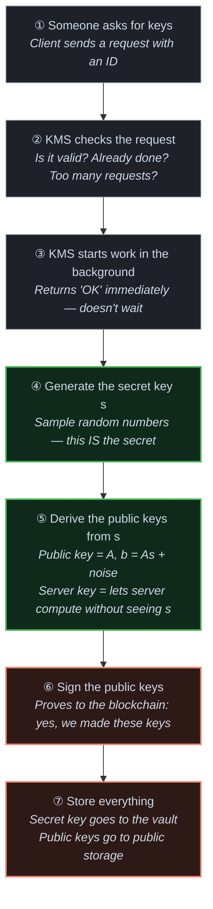

# KMS Key Generation — Simple Story

> A beginner-friendly version of [kms-keygen-deep-dive.md](./kms-keygen-deep-dive.md).  
> Each step here maps to a section there — follow the 🔍 links to go deeper.

**Related notes:**
- [KMS Folder & Run Overview](./kms-folder-and-run-overview.md)
- [LWE Math → Code Mapping](./lwe-math-to-code-mapping.md)
- [Key Generation Deep Dive](./kms-keygen-deep-dive.md) ← the technical version

---

## The One-Sentence Story

> The KMS receives a request, **generates a secret key and a matching public key**, signs the result so the blockchain can trust it, then stores everything.

---

## An Analogy: The Locksmith

Think of the KMS as a **locksmith** running a key-cutting service.

| Analogy | Real Thing |
|---|---|
| The locksmith's shop | KMS server |
| A customer orders a lock+key pair | Client sends a `KeyGenRequest` |
| The locksmith cuts the **key** | KMS samples the secret `s` (`ClientKey`) |
| The locksmith makes the **lock** (public) | KMS computes `(A, b=As+e)` (`FhePublicKey`) |
| The locksmith stamps a certificate on it | KMS signs with EIP-712 |
| The locksmith stores the key in a vault | KMS writes to S3/MinIO |
| Anyone with the lock can leave a sealed message | Anyone with `FhePublicKey` can encrypt |
| Only the locksmith's secret key opens it | Only `ClientKey` can decrypt |

---

## The Simple Flow

---

## Step by Step

### ① Someone asks for keys
The client (could be a blockchain gateway, a test tool, etc.) sends a message saying:
*"Please generate an FHE key pair, here is a unique ID for this request."*

🔍 Deep dive: [Layer 1 — key_gen_impl](./kms-keygen-deep-dive.md#layer-1--grpc-entry-key_gen_impl)

---

### ② KMS checks the request
Before doing any real work, the KMS asks:
- Have I seen this request ID before? (avoid duplicate work)
- Is another key generation already running? (avoid collision)
- Is the system overloaded? (rate limiting)

If any check fails, it rejects immediately. Otherwise, it records the request and moves on.

🔍 Deep dive: [Layer 1 — key_gen_impl](./kms-keygen-deep-dive.md#layer-1--grpc-entry-key_gen_impl)

---

### ③ KMS starts work in the background
Key generation is slow (seconds of CPU work). The KMS **does not make the client wait**.  
It starts the job in the background and immediately replies with: *"Got it, I'll let you know when it's done."*

The client must later ask: *"Is my key ready yet?"* — this is `get_key_gen_result`.

🔍 Deep dive: [Layer 2 — key_gen_background](./kms-keygen-deep-dive.md#layer-2--background-work-key_gen_background)

---

### ④ Generate the secret key `s`
This is where the actual math happens.

The KMS calls `ClientKey::generate(config)` from the `tfhe-rs` library.  
Internally, it samples a vector of small random numbers — **that vector is `s`**, the secret key.

The config (called `DKGParams`) controls:
- How big `s` is (dimension `n`)
- What distribution to sample from (binary, ternary, Gaussian…)
- How much security we want

> **Why random numbers?** The security of LWE comes from the fact that `s` is hard to guess. If it were predictable, an attacker could break the encryption.

🔍 Deep dive: [Layer 4 — generate_client_fhe_key](./kms-keygen-deep-dive.md#layer-4--the-actual-crypto-generate_uncompressed_fhe_keys--generate_client_fhe_key)  
🔍 Math: [LWE Math → Code Mapping §1](./lwe-math-to-code-mapping.md)

---

### ⑤ Derive the public keys from `s`

Two public keys are built from `s`:

**`FhePublicKey`** — what the user encrypts with.
- The library picks a random matrix `A` and computes `b = A·s + small_noise`
- `(A, b)` is published. Without knowing `s`, you can't recover it from `b` (that's the LWE hardness assumption)

**`ServerKey`** — what the KMS server uses to *compute* on encrypted data.
- This is a more complex object: it encodes `s` in a special "homomorphically encrypted" form
- It lets the server run FHE operations (additions, multiplications on ciphertexts) **without ever seeing the plaintext**

> **Analogy**: `FhePublicKey` is the padlock anyone can lock. `ServerKey` is a special robot arm that can rearrange locked boxes without opening them.

🔍 Deep dive: [Layer 4 — Step 2](./kms-keygen-deep-dive.md#step-2-generate-public-keys-from-s)

---

### ⑥ Sign the public keys
The KMS hashes the public keys and signs the hashes using **EIP-712** (an Ethereum signing standard).

Why? The blockchain (or any verifier) needs proof that:
- *These specific keys were generated by this KMS*
- *They correspond to this specific request ID*

Without a signature, anyone could swap in fake public keys.

🔍 Deep dive: [Layer 6 — KmsFheKeyHandles](./kms-keygen-deep-dive.md#layer-6--signing-and-wrapping-kmsfhekeyhandles)

---

### ⑦ Store everything
- **Secret key** (`ClientKey`) → written to **private encrypted storage** (S3/MinIO vault)
- **Public keys** (`FhePublicKey`, `ServerKey`) + **signed digests** → written to **public storage**

The private key never leaves the vault. The public keys can be freely distributed to users who want to encrypt data.

🔍 Deep dive: [Layer 6](./kms-keygen-deep-dive.md#layer-6--signing-and-wrapping-kmsfhekeyhandles)

---

## What are all those key types?

| Name | Plain English | Who uses it |
|---|---|---|
| `ClientKey` | The secret. The master key. | KMS only — never shared |
| `FhePublicKey` | The padlock. Encrypt with this. | Given to anyone who wants to send encrypted data |
| `ServerKey` | The robot arm. Compute on ciphertexts. | KMS server, during FHE evaluation |
| `CompressedXofKeySet` | A compressed bundle of all of the above | Used internally to save disk space |

---

## Why is it slow?

Generating a `ServerKey` requires building a **bootstrapping key** — a large table of ~millions of numbers derived from `s`. This is what makes FHE computation possible, but it takes seconds of CPU time to construct. That's why the KMS offloads it to a separate CPU thread pool and doesn't block the network.

---

## What to read next

- To understand the math behind step ④–⑤: [LWE Math → Code Mapping](./lwe-math-to-code-mapping.md)
- To trace every function call: [Key Generation Deep Dive](./kms-keygen-deep-dive.md)
- To understand the bigger system: [KMS Folder & Run Overview](./kms-folder-and-run-overview.md)
