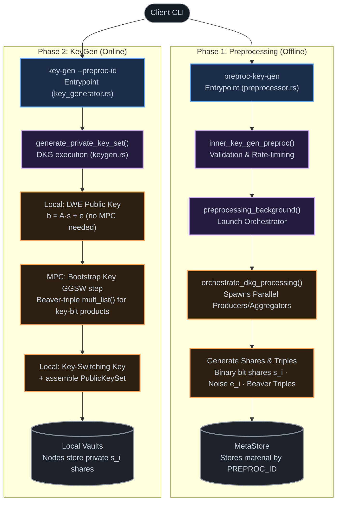

# Threshold DKG Preprocessing & KeyGen Deep Dive

DKG in threshold mode = preprocessing phase + collaborative online KeyGen. Real code: `core/threshold-execution` (TFHE).

> **Back to:** [tutorial.md](./tutorial.md) · [keygen_deep_dive.md](./keygen_deep_dive.md)

> [!warning] Correction (2026-07-13)
> An earlier version of this doc traced `core/threshold-bgv`, an unused experimental crate. Wrong claims were "ternary coefficients" and a BGV-style $s^2$ relinearization term — neither exists in the real path below.

---

## 1. What TFHE DKG Actually Produces

Three separate artifacts — not one $b=As+e$ pair plus a relinearization key like BGV — generated in a fixed order by **`generate_all_compressed_public_keys`** (`core/threshold-execution/src/endpoints/keygen.rs:524`; order comment at `keygen.rs:511`: *"must match... what is in tfhe-rs"*).

**Secret key shares** (**`generate_private_key_set`**, `keygen.rs:352`): LWE "hat" key (`:369`) → LWE key, only if dedicated compact-PK params exist, else = hat key (`:378`) → GLWE key (`:394`, unconditional — used only for bootstrapping) → optional compression/SNS/OPRF keys.

Coefficients are **binary**, $s_i \in \{0,1\}$ — not ternary. Source: `glwe_key.rs:29` ("binary coefficients"); the real preprocessing trait only exposes `next_bit_vec` (`preprocessing/mod.rs:93`) — no ternary primitive outside the unused bgv crate.

**Public artifacts:**

| Artifact | What it is | MPC needed? |
|---|---|---|
| LWE public key | $b=As+e$ — `negacyclic_convolution(mask, sk) + noise` (`tfhe_internals/lwe_key.rs:259`) | No — mask is public |
| Key-switching key (KSK) | Decomposed LWE encryption of one key's bits under another (`tfhe_internals/lwe_keyswitch_key_generation.rs`) | No — linear |
| Bootstrap key (BK) | GGSW encryption of each LWE-key bit under the GLWE key (`tfhe_internals/lwe_bootstrap_key_generation.rs`) — enables TFHE's programmable bootstrapping; no BGV equivalent | **Yes** |

> [!info] Why BK needs Beaver triples
> GGSW encoding requires the product (GLWE-key bit) × (LWE-key bit) — both secret-shared, so no party can compute it alone. `ggsw_ciphertext.rs:9-12` documents this explicitly. The product is computed via `mult_list`, drawing triples from preprocessing (`ggsw_ciphertext.rs:157`), then fed into the GGSW plaintext (`ggsw_encode_messages`, `:140`) — everything after that is local (`encrypt_constant_ggsw_ciphertext`, `:240`).

**Beaver-triple protocol** (`online/triple.rs:34`): given a precomputed triple $(x,y,z)$ with $z=xy$, to get a share of $p=k_1 k_2$, jointly open $\varepsilon=k_1-x$ and $\rho=k_2-y$, then each party computes locally: $\text{share}_j(p) = z_j + k_{2,j}\varepsilon - x_j\rho$.

**Shamir sharing** (generic background): a secret $s$ is the constant term of a random degree-$t$ polynomial $P(X)$; party $j$'s share is $P(x_j)$ at its assigned point. Any $t{+}1$ shares reconstruct $s=P(0)=\sum_j \text{share}_j \cdot L_j(0)$ via Lagrange interpolation. All shares here (key bits, noise, triples) are Shamir shares over this ring — additions/scalar-mults on shares are free (stay linear); only products need the triple protocol above.

---

## 2. DKG Preprocessing Phase (The Code)

Pre-computes secret key bit shares, noise shares, and Beaver triples ahead of time.

```
[Client CLI: preproc-key-gen]
  → preprocessor.rs: key_gen_preproc → inner_key_gen_preproc (validate/rate-limit/epoch check)
  → launch_dkg_preproc → preprocessing_background
       ├── PreprocessingOrchestrator → orchestrate_dkg_processing_small_session()
       │     spawns: TriplesAggregator, RandomsAggregator, DkgBitProcessor
       ├── EIP-712 signs PREPROC_ID (compute_external_signature_preprocessing)
       └── stores results in MetaStore<BucketMetaStore>
```

- `launch_dkg_preproc` — `core/service/src/engine/threshold/service/preprocessor.rs:81` — sets up parallel `SmallSession` channels.
- `preprocessing_background` — `preprocessor.rs:188` — runs the orchestrator, signs the result.
- `get_num_correlated_randomness_required` — `core/threshold-execution/src/online/preprocessing/orchestration/dkg_orchestrator.rs:470` — sizes the triples/randoms/bits needed for the requested DKG params.

---

## 3. Collaborative KeyGen (The Code)

```
[Client CLI: key-gen --preproc-id <ID>]
  → key_generator.rs: KeyGenerator::key_gen (L1869) → inner_key_gen (L550) → key_gen_background (L1316)
  → keygen.rs: KG::keygen / compressed_keygen (L140), KG = SecureOnlineDistributedKeyGen128
       → generate_private_key_set (L352): LWE hat → LWE → GLWE → compression/SNS/OPRF shares
       → generate_all_compressed_public_keys (L524), in spec order:
            LWE public key (local) → compression keys → KSK (local)
            → Bootstrap key (MPC: Beaver triples for GGSW, see §1)
            → SNS/compression/OPRF variants → return PublicKeySet + PrivateKeySet share
```

Only the Bootstrap Key step uses MPC multiplication — everything else (public key, KSK) is linear and computed locally per party. Generation order is fixed to match `tfhe-rs`'s own spec (comment at `keygen.rs:511`).

---

## 4. DKG Flow Diagram


